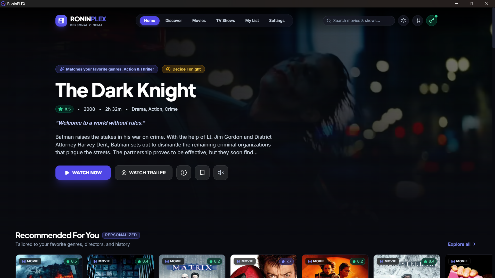
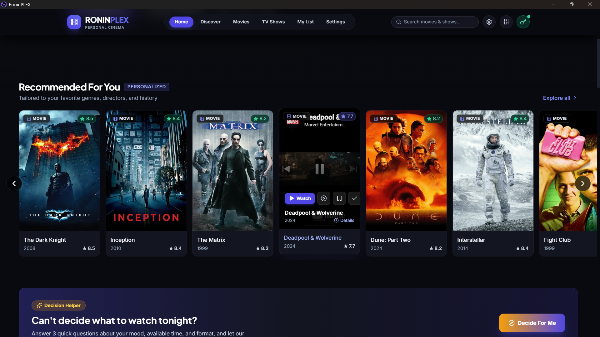
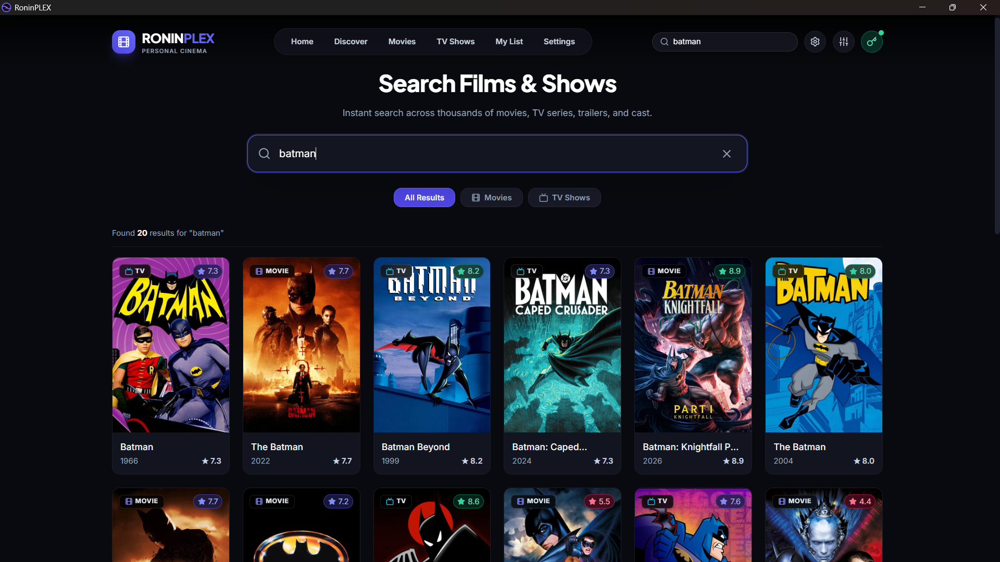
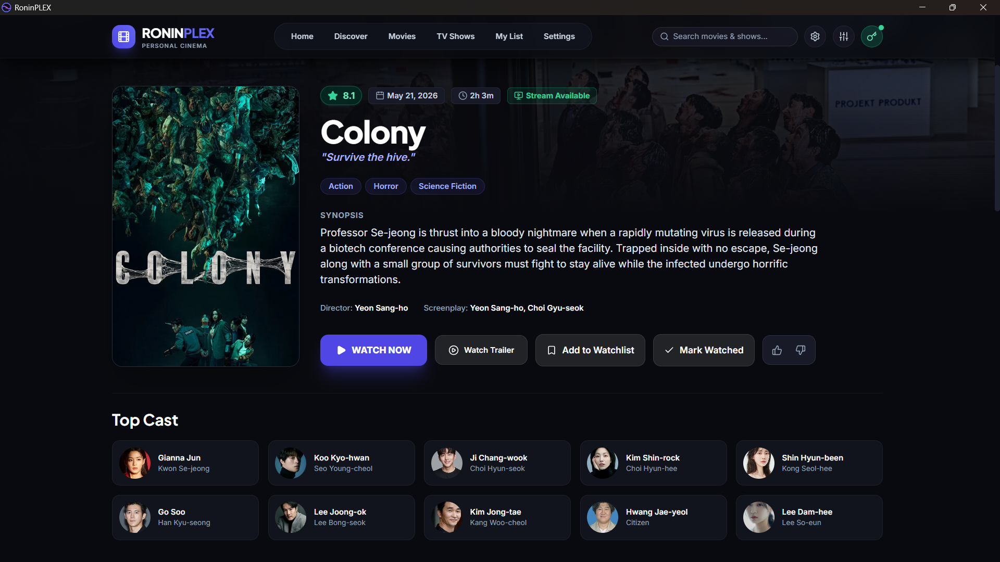
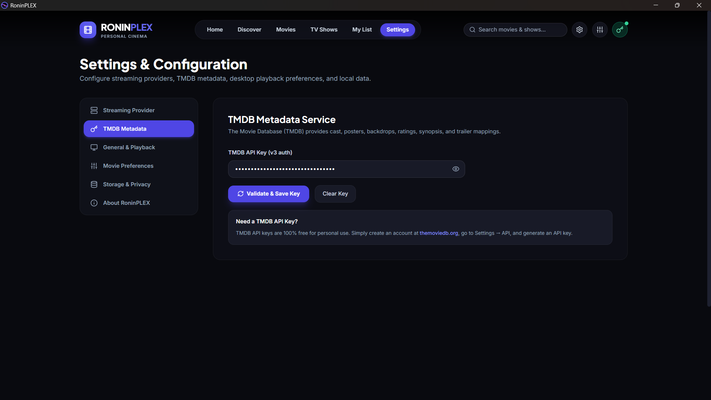

# 🎬 RoninPLEX (v1.1.0)

> **A premium, personal cinema discovery & streaming desktop application for Windows.**

**RoninPLEX** delivers a clean, high-performance, Netflix-inspired desktop experience for discovering, tracking, and watching movies and TV series on your Windows laptop. It combines rich metadata from The Movie Database (TMDB), YouTube trailer previews, playback history ("Continue Watching"), mood-based recommendations, and a completely modular **Streaming Provider Architecture**.

---
## 📸 Interface Preview

A look at RoninPLEX in action.

<p align="center">
  
  
</p>

<p align="center">
  
  
</p>

<p align="center">
  
</p>

---

## ✨ Features

- **Dark Cinematic Interface**: Sleek, distraction-free aesthetic with custom backdrop art, genre badges, and smooth carousels.
- **Hover Trailer Previews**: Hover over any card for 400ms to watch the official YouTube trailer with singleton audio management (only one trailer plays at a time).
- **Intelligent Mood Assistant ("Tonight Picker")**: A 3-question mood engine to quickly decide what to watch tonight based on runtime, intensity, and genre.
- **Cinema Vault**: Persistent local Watchlist, Watched history with custom star ratings, and automatic Continue Watching shelf.
- **Modular Streaming Architecture**: Decoupled provider layer that connects to authorized streaming endpoints (VidSrc, custom REST APIs, or local public-domain demo streams) with zero UI coupling.
- **Multi-Format Video Player**: Full support for embed players, HLS (`.m3u8` adaptive bitrate), and standard MP4 files.
- **TV Series Hub**: Seamless episode navigation drawer and automated "Next Episode" button.
- **100% Private & Local**: Zero remote telemetry, zero analytics tracking, and all preferences/keys stored strictly in your local Windows app storage.

---

## 💻 System Requirements

- **Operating System**: Windows 10 (version 1803 or later) or Windows 11 (64-bit).
- **Runtime Requirement**: Microsoft Edge WebView2 Runtime.
  *(Pre-installed on virtually all modern Windows 10 & 11 PCs. The RoninPLEX installer will automatically verify and install this if absent.)*
- **Hardware**: Any modern x64 processor, 4 GB RAM, and ~100 MB free disk space.

---

## 🚀 Normal User Installation (No Programming Tools Needed)

You do **not** need Node.js, Rust, Git, or any coding tools to install and run RoninPLEX.

### Option A: Graphical Setup Installer (Recommended)
1. Go to the [**GitHub Releases**](../../releases/tag/v1.1.0) page.
2. Download **`RoninPLEX_1.1.0_x64-setup.exe`**.
3. Double-click the downloaded setup file.
4. *(Optional)* Click **Browse...** on the installation folder screen if you want to install RoninPLEX on a secondary drive (e.g., `D:\Applications\RoninPLEX` or `C:\Program Files\RoninPLEX`).
5. Complete the installation wizard.
6. Launch **RoninPLEX** from your **Desktop** shortcut or **Start Menu**.

### Option B: MSI Installer
If you prefer Windows Installer packages for managed installations:
1. Download **`RoninPLEX_1.1.0_x64_en-US.msi`** from the Releases tab.
2. Double-click to install.

### Option C: Portable Release
1. Download the standalone `roninplex.exe`.
2. Place it in any folder and run it directly without installing.

---

## ⚙️ TMDB Configuration

RoninPLEX includes offline fallback datasets so you can explore immediately. To unlock live search, full cast lists, and real-time movie ratings:

1. Open **RoninPLEX**.
2. Click the **Settings** gear icon in the top navigation bar.
3. Select the **TMDB API** tab.
4. Enter your free [The Movie Database (TMDB) API Key](https://www.themoviedb.org/settings/api).
5. Click **Save & Test Connection**. Your key is stored securely in local app storage and is never sent to external third parties.

---

## 📡 Streaming Provider Architecture

RoninPLEX is architected with complete decoupling between the presentation layer and streaming providers:

```
┌─────────────────────────────────────────────────────────────┐
│                    RoninPLEX React UI                       │
│    (Home, Watch, MovieDetails, TvDetails, VideoPlayer)      │
└──────────────────────────────┬──────────────────────────────┘
                               │ Request stream by TMDB ID
                               ▼
┌─────────────────────────────────────────────────────────────┐
│                     StreamingManager                        │
│     - Provider Registry & Dynamic Switching                 │
│     - Availability Caching & Fallback Coordination          │
└──────────────────────────────┬──────────────────────────────┘
                               │
            ┌──────────────────┴──────────────────┐
            ▼                                     ▼
┌─────────────────────────┐           ┌───────────────────────┐
│     VidSrc Provider     │           │     Demo Provider     │
│  (https://vidsrc.to/)   │           │ (Public Domain HLS)   │
└─────────────────────────┘           └───────────────────────┘
            │                                     │
            └──────────────────┬──────────────────┘
                               │ Normalized PlaybackSource
                               ▼
┌─────────────────────────────────────────────────────────────┐
│                 Integrated Video Player                     │
│    (Iframe Embed Engine / HLS.js / Native HTML5 Video)      │
└─────────────────────────────────────────────────────────────┘
```

### Switching Active Providers
In RoninPLEX, navigate to **Settings ➔ Streaming Provider** to choose:
1. **VidSrc (vidsrc.to)** *(Default)*: Direct movie and TV episode embeds.
2. **Demo Provider (Public Domain)**: Reliable testing streams (Big Buck Bunny, Sintel) for verifying audio and HLS performance.
3. **Custom API**: Connect to your own private streaming server, media library proxy, or authorized REST API.
4. **Disabled**: Browse strictly as a metadata and discovery hub.

### How to Add a New Provider
Developers can easily introduce new streaming adapters:
1. Review [`src/services/streaming/providers/ProviderTemplate.ts`](file:///src/services/streaming/providers/ProviderTemplate.ts).
2. Create `src/services/streaming/providers/MyProvider.ts` implementing the `StreamingProvider` interface:
   ```typescript
   export class MyProvider implements StreamingProvider {
     getId() { return 'my-provider'; }
     getName() { return 'My Custom Stream Provider'; }
     async getMovie(tmdbId: number): Promise<StreamingMovie> { ... }
     async getTVEpisode(tmdbId: number, s: number, e: number): Promise<StreamingEpisode> { ... }
   }
   ```
3. Register the provider instance in `StreamingManager.ts`.

---

## 🛠️ Developer Setup & Build Instructions

> **Note**: This section is strictly for developers contributing to RoninPLEX. Normal users should use the pre-built installer above.

### Prerequisites
- [Node.js](https://nodejs.org/) (v20 or v22 LTS recommended)
- [Rust & Cargo](https://rustup.rs/) (v1.80+)
- [C++ Build Tools for Visual Studio](https://visualstudio.microsoft.com/visual-cpp-build-tools/) (required by Tauri on Windows)

### 1. Clone the Repository
```bash
git clone https://github.com/your-username/RoninPLEX.git
cd RoninPLEX
```

### 2. Install Frontend Dependencies
```bash
npm install
```

### 3. Run in Web Development Mode
```bash
npm run dev
```
Open `http://localhost:5173` in your browser.

### 4. Run in Desktop Development Mode (Tauri)
```bash
npm run tauri:dev
```
This compiles the Rust backend and opens the native Windows desktop window with hot reloading.

### 5. Build Desktop Installer & Executables
```bash
npm run tauri:build
```
Generated artifacts will be created in:
- Setup Installer: `src-tauri/target/release/bundle/nsis/RoninPLEX_1.1.0_x64-setup.exe`
- MSI Package: `src-tauri/target/release/bundle/msi/RoninPLEX_1.1.0_x64_en-US.msi`
- Portable `.exe`: `src-tauri/target/release/roninplex.exe`

---

## 🔒 Privacy, Security & Disclaimers

- **Strict Personal Use**: RoninPLEX is built strictly for personal, private laptop usage.
- **No Piracy or DRM Bypassing**: RoninPLEX does not contain torrent clients, scrapers, DRM circumvention tools, or unauthorized streaming hosts. Embed providers run inside standard sandboxed browser frames according to their own authorized policies.
- **Client-Side Secret Storage**: All credentials (such as your personal TMDB API key) are stored locally in your machine's browser/Tauri cache and are never shared or uploaded.
- **TMDB Attribution**: This product uses the TMDB API but is not endorsed or certified by TMDB.

---

## 📄 License

This project is released under the [MIT License](LICENSE).
